### Hi there 👋
Side Projects by Mevlüt Can Gündoğan

- Guitar Pedal

- Temperature Monitoring Device

- AM Radio

- Ray Tracer

- Camera Objective (Petzval’s Lens)

- Fiber-Optic coupler

- Analog Control (PID)

- Digital signal transmission

- Analog signal transmission

- Flappy Bird AI

- Image Classifier (cs231n)

- Rigid Body Numerical Analysis in Python

- SpacePong Game and Bot

# Electronics

## DIY Guitar Pedal

Tunable pedal to add sound effects to electronic guitars.

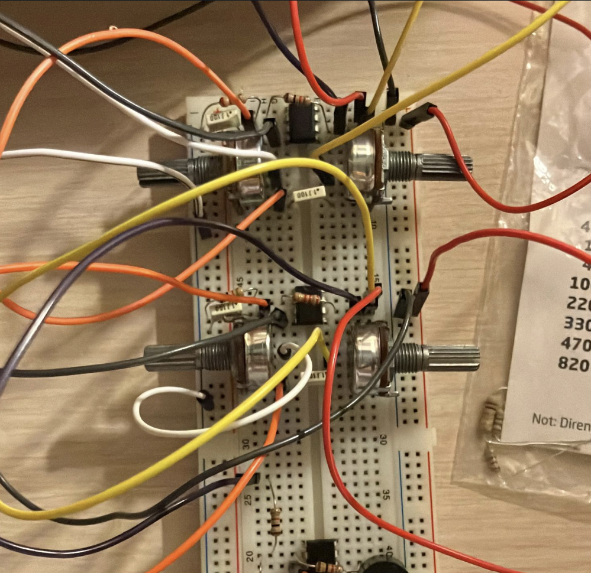

## Parallel Temperature Monitoring IOT Device

Gathers temperature readings from up to 6 different sources and reports them to a static server.

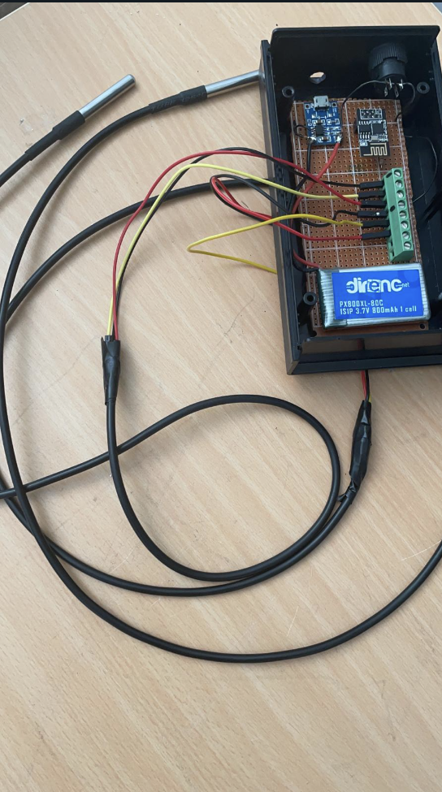

## AM Radio Transmitter

Tunable radio transmitter using a 9V battery. Uses a BJT as an amplifier. Can broadcast around 1 to 2 MHz.

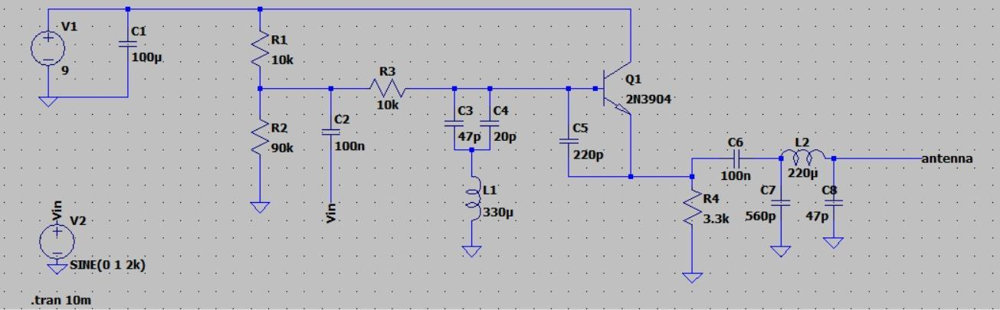

# Optics and Photonics

## Ray Tracing

Renders 3D pictures by physically calculating the paths of light rays.

## Petzval’s Lens

Zemax project to create an objective lens, the image produced by this objective can be seen below.

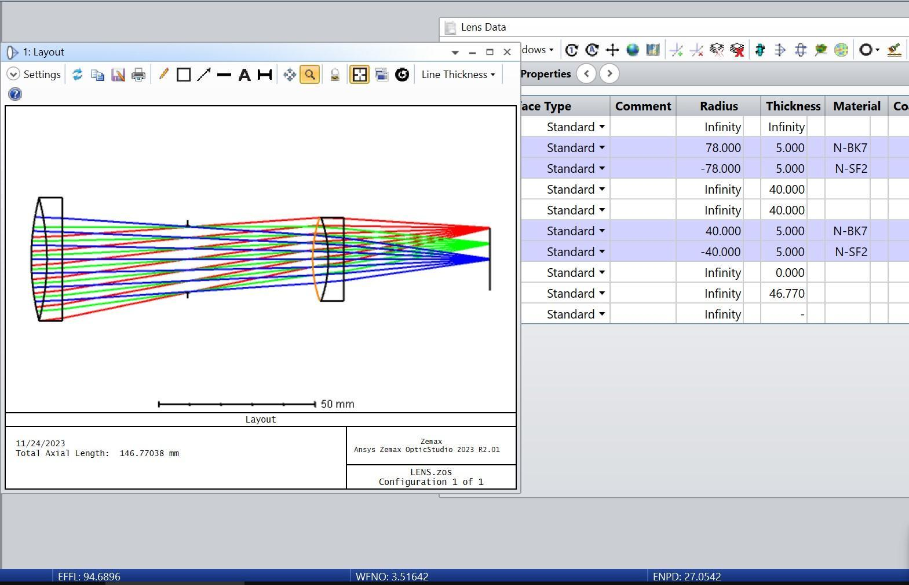

## Fiber Coupler

Zemax project to couple 2 fiber-optics. Achieves near perfect coupling efficiencies.

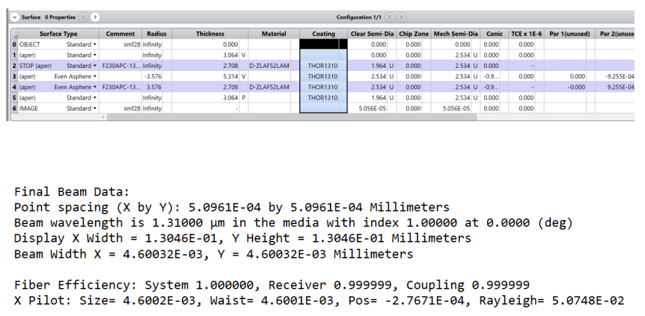

# Signal Processing

## Analog Controller

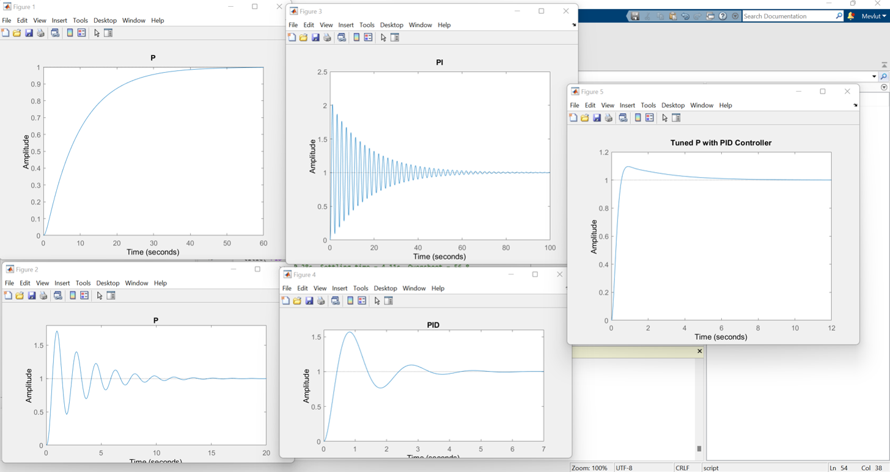

## 16QAM modulation and AD conversion

Experimenting with digital signal transmission and sequence retrieval.
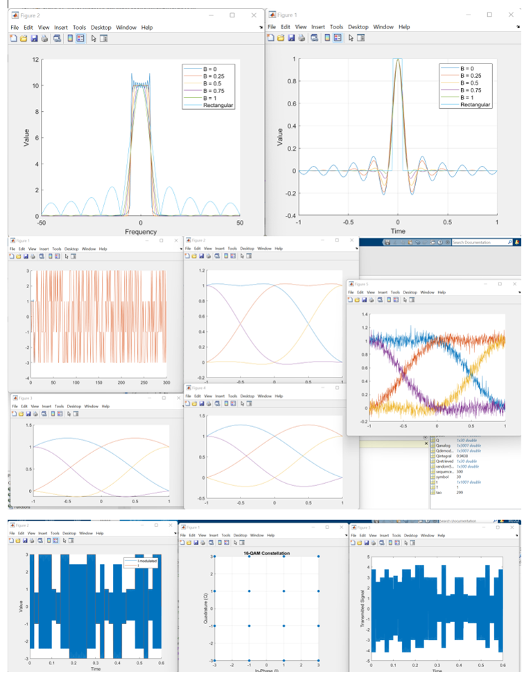

## Signal Modulation/Demodulation

Experimenting with analog signal transmission and retrieval.

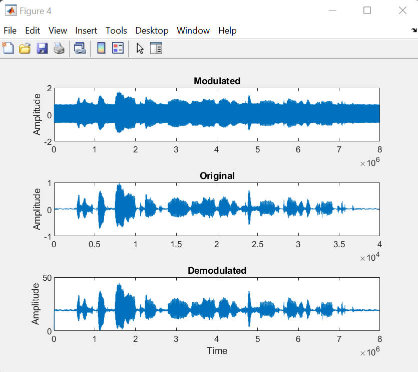

# Machine Learning

## Genetic Algorithm

Genetic algorithm that mutates the weights of a neural network to play the popular mobile game “Flappy Bird”.

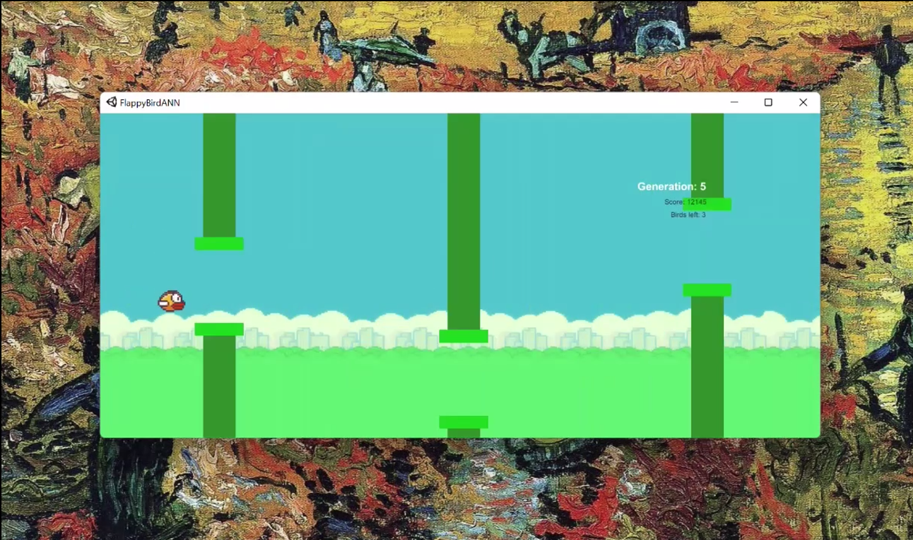

## MLP Image Classification

Done as a part of CS231n machine learning class.

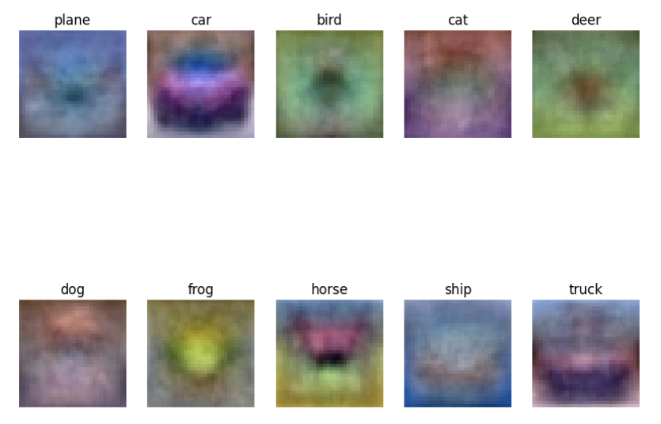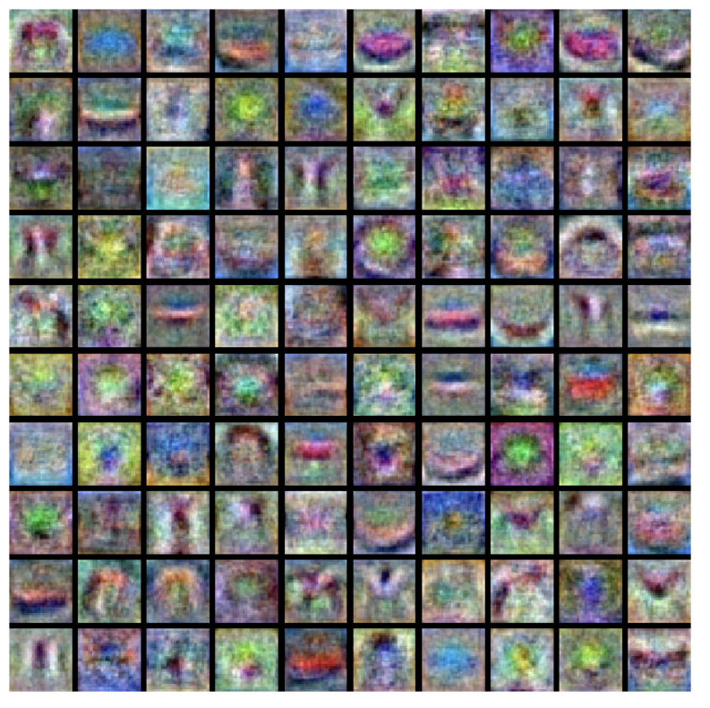

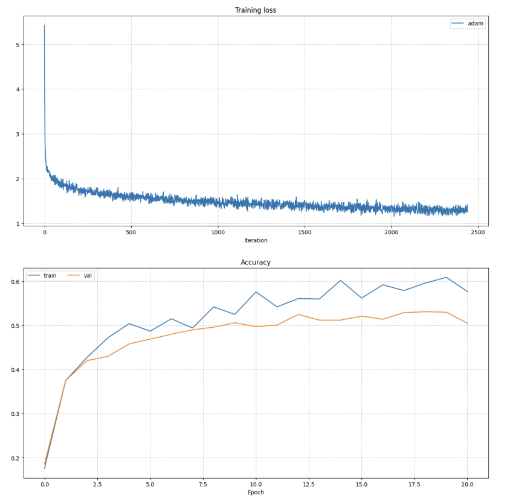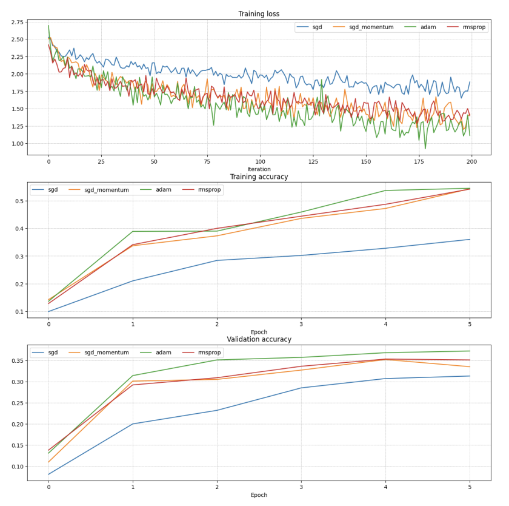

# Miscellaneous

## Numerical Analysis in Python

Using 4th order Runge-Kutta method to model the complex behaviors of rigid body rotations in free space. This project was used to demonstrate the tennis racket theorem.

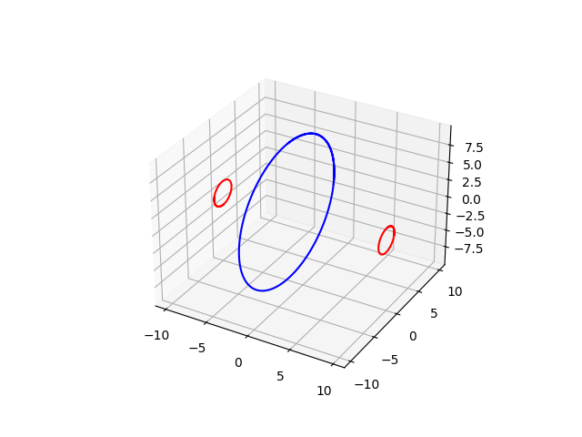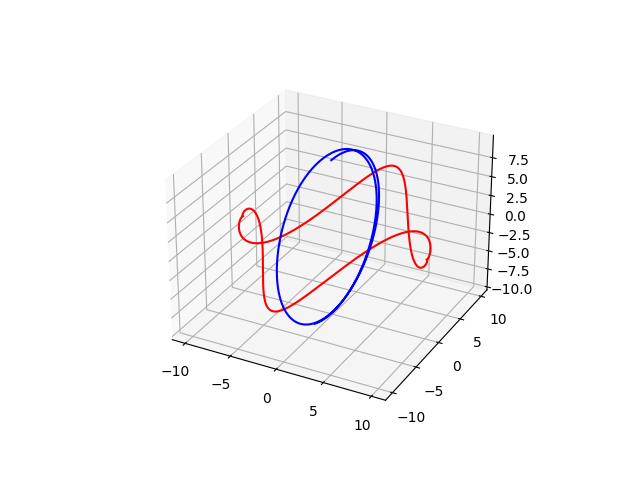

## SpacePong Game and Bot

This was a Java aws application for the freshman year comp-sci project. The gif below shows the bot playing it.

![[video-to-gif output image]](Images/gfn-video-to-gif-output-image.gif)

