### Hi there 👋
Side Projects by Mevlüt Can Gündoğan
- Optics and Photonics
    - Ray Tracer
    - Wave propagation simulations
    - Aberration Correction
    - Experimentally Measuring Point Spread Functions
    - Camera Objective (Petzval’s Lens)
    - Fiber-Optic coupler
- Electronics
    - AZ (Noise Blocking) OpAmp
    - PSP Flip Flop
    - AM Radio
    - Guitar Pedal
    - Temperature Monitoring Device
- Machine Learning
    - Private LLM Server
    - Flappy Bird AI
    - MLP Image Classifier (cs231n)
    - CNN Image Classifier (cs231n)
- Miscellaneous
    - Autonomous Drone
    - Rigid Body Numerical Analysis in Python
    - SpacePong Game and Bot
# Optics and Photonics

## Ray Tracing
Renders 3D pictures by physically calculating the paths of light rays.

(C++)

## Wave Propagation Simulations

Numerical solutions of the Nonlinear Schrödinger Equation for a Gaussian Beam.

(Python)

## ML Model for Aberration Correction 

This physically informed neural network reduces aberration and noise in microscopical images.

(Python)

## Experimental PSF Measurements

Imaging fluorescent beads and processing the data to experimentally determine the point spread functions of microscopes.

## Petzval’s Lens
Zemax project to create an objective lens, the image produced by this objective can be seen below.

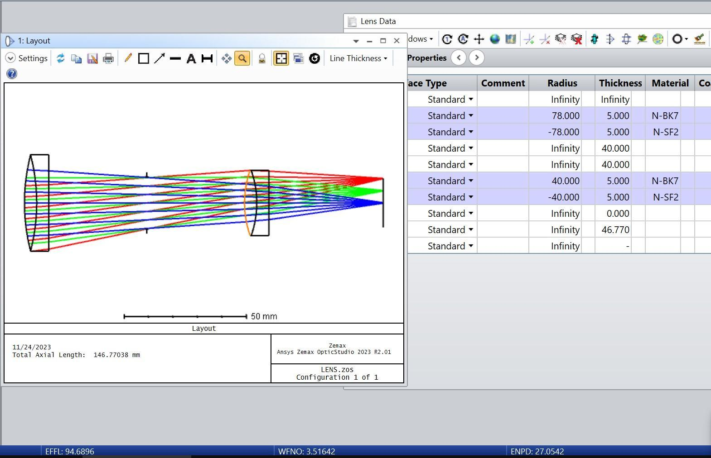

## Fiber Coupler
Zemax project to couple 2 fiber-optics. Achieves near perfect coupling efficiencies.

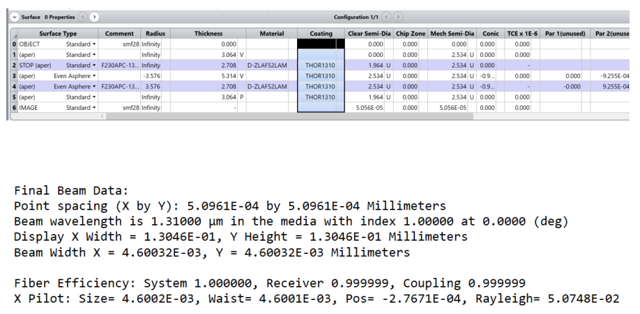

# Electronics

## AZ Amplifier (Suppress Low Frequency Noise) 
OpAmp that samples low frequency noise and compensates for it.

(Cadence)

## Pseudo Single Phase Flip-Flop
Uses a delayed clock to sample input at the rising edge.

(Cadence)

## Parallel Temperature Monitoring IOT Device
Gathers temperature readings from up to 6 different sources and reports them to a static IP.

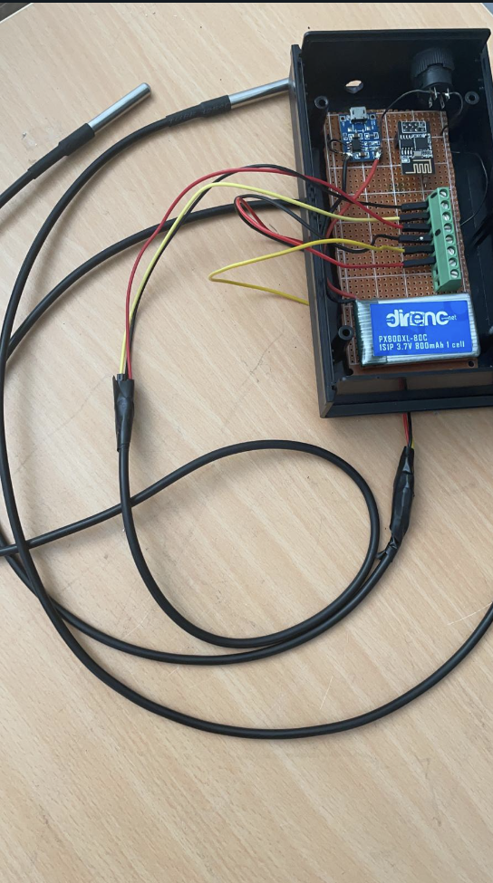

## AM Radio Transmitter

Tunable radio transmitter using a 9V battery. Uses a BJT as an amplifier. Can broadcast around 1 to 2 MHz.

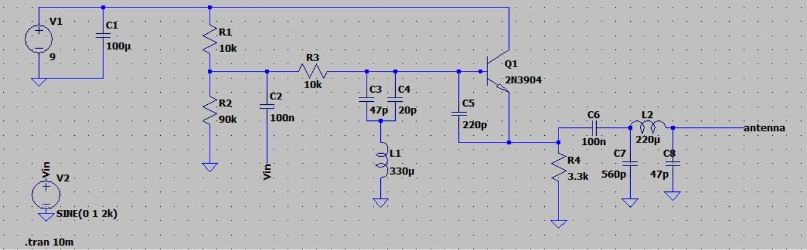

Oscilloscope readings:
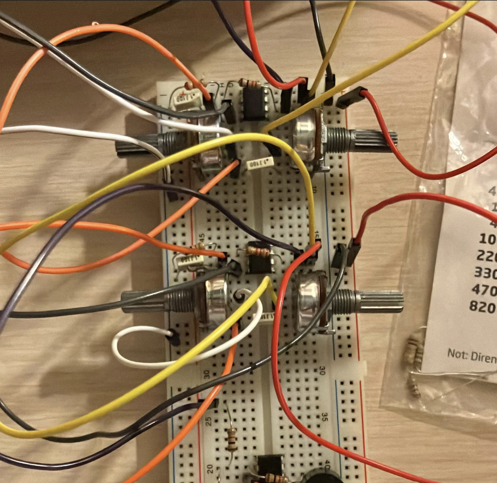
20/assets/72755125/566b4115-a24f-4b16-9619-adc934621e18" width="300">

# Machine Learning

## Private LLM Server
Locally runs an LLM on an ORIN. Serves the model using NGROK.

## Genetic Algorithm

Genetic algorithm that mutates the weights of a neural network to play the popular mobile game “Flappy Bird”.

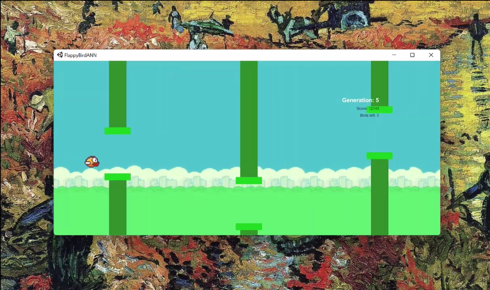

## MLP Image Classification

Done as a part of CS231n machine learning class.

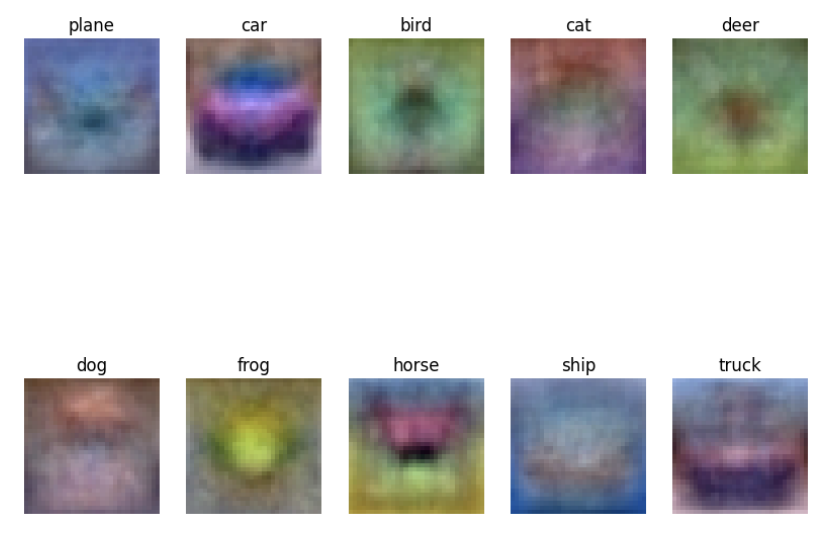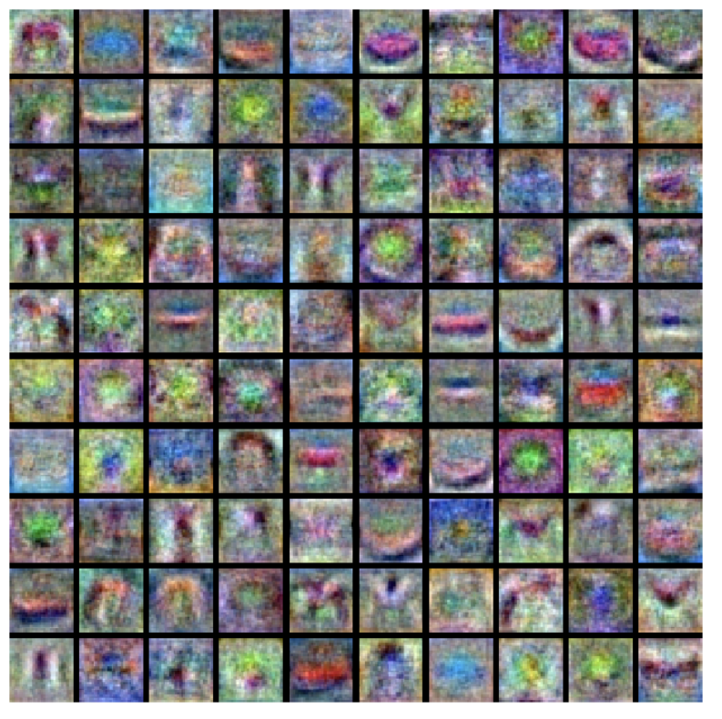

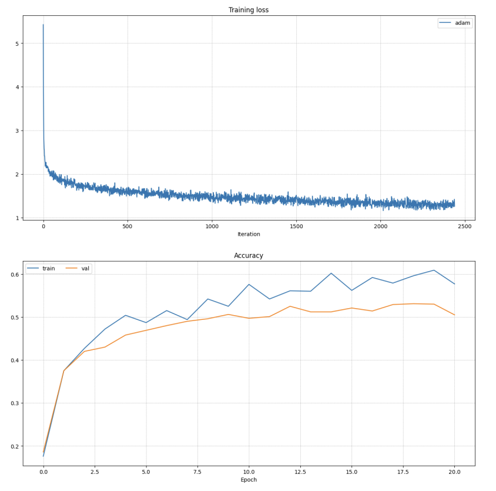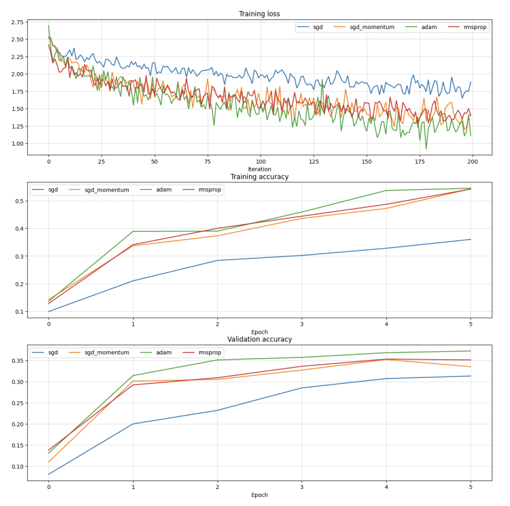

## CNN Image Classification

Done as a part of CS231n machine learning class using PyTorch.

### Architecture:
((CONV -> PReLU -> NORM)^2 POOL)^2 -> FNN -> FNN -> FNN

Update function: Adam

The final training weights of the first layer after 10 epochs over CIFAR-10:
(Raw - Upsampled - Upsampled & Contrast Enhanced)

# Miscellaneous

## Autonomous Drone
Custom drone controlled autonomously by our server to find available parking spots in Koç University.

Server uses Spring Boot handle communication between user-server-ground control-drone.
Flutter app serves results to the client side.
QGC generates mission commands.
Fine-tuned YOLO model detects and locates empty spots.
PSQL database holds images, locations and missions.

## Numerical Analysis in Python

Using 4th order Runge-Kutta method to model the complex behaviors of rigid body rotations in free space. This project was used to demonstrate the tennis racket theorem.

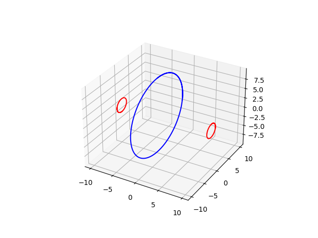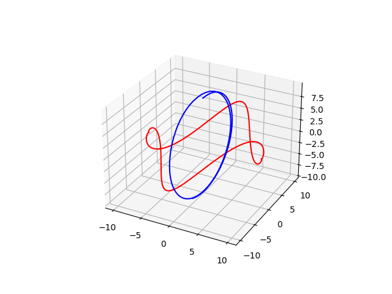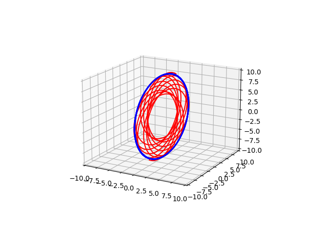

## SpacePong Game and Bot

This was a Java aws application for the freshman year comp-sci project. The gif below shows the bot playing it.

![[video-to-gif output image]](Images/gfn-video-to-gif-output-image.gif)

